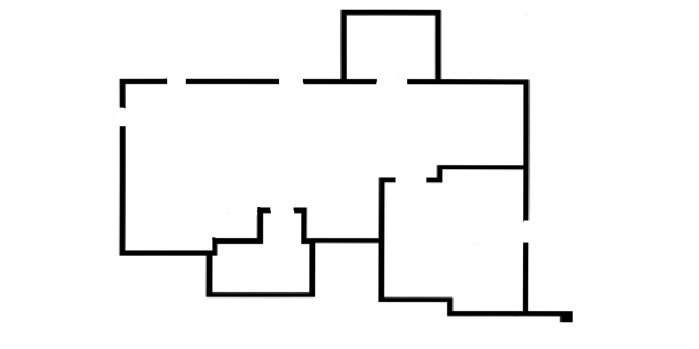
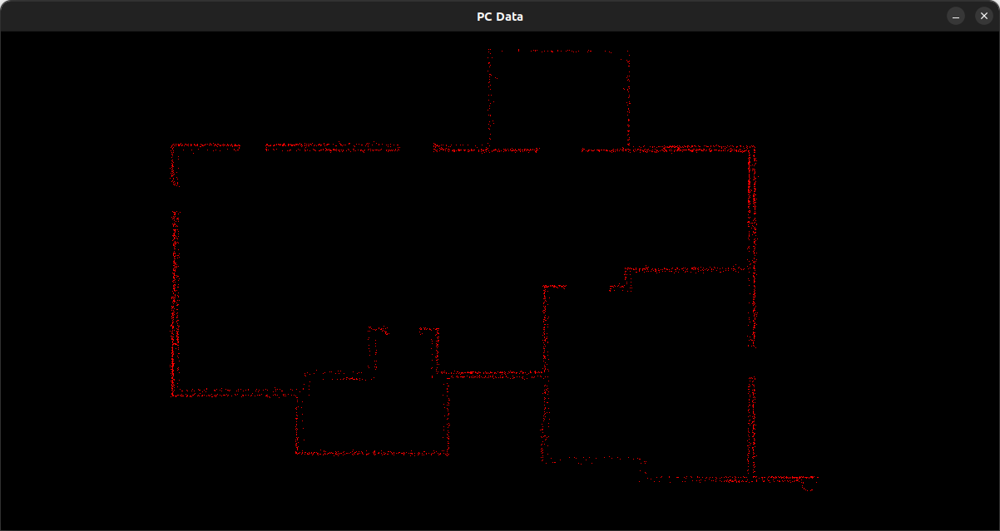
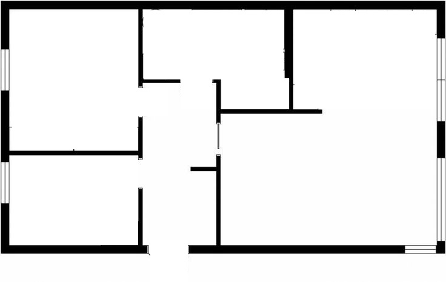
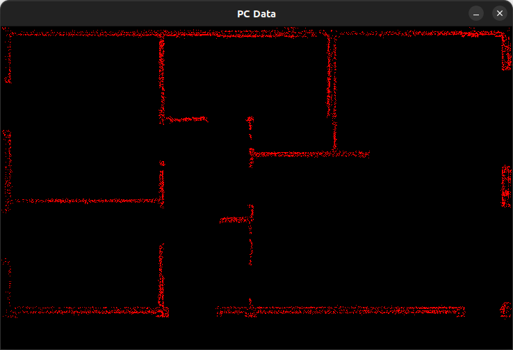

# SLAM Project with Python

This project is to develop SLAM system using artificial point cloud data generated based on the floor plan image.

## Floor plans

Floor plan 1 | PC Data
:-----------:|:----------:
 | 

Floor plan 1 | PC Data
:-----------:|:----------:
 | 

## Plans

Integrating Quadtree mapping with the SLAM to get a memory efficient map.
